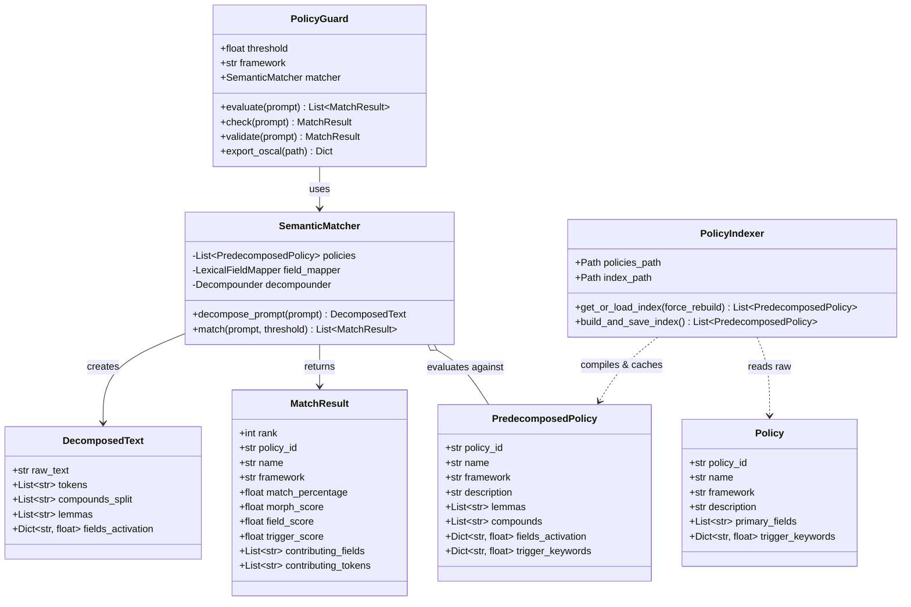
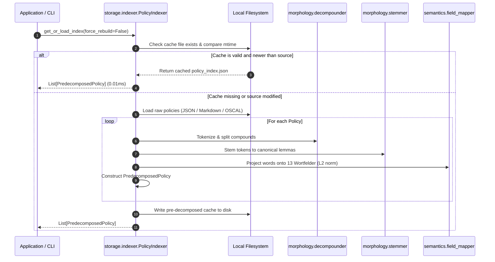
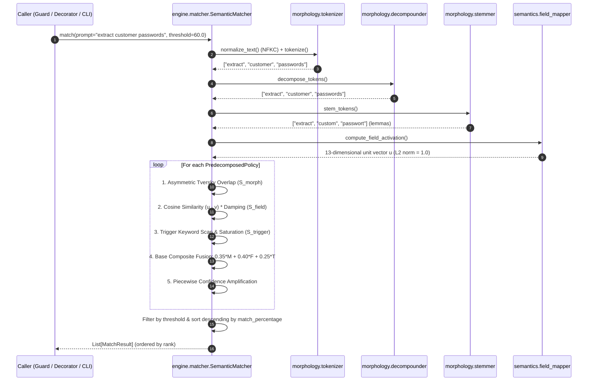

# 1. Overview & System Architecture

Relevant source files

- [src/semantic_matcher/__init__.py](file:///Users/jonasnowak/Documents/repos/semantic-prototype/src/semantic_matcher/__init__.py#L1-L26) — Public exports and package version
- [src/semantic_matcher/models.py](file:///Users/jonasnowak/Documents/repos/semantic-prototype/src/semantic_matcher/models.py#L1-L50) — Core data structures (`Policy`, `DecomposedText`, `PredecomposedPolicy`, `MatchResult`)
- [src/semantic_matcher/engine/matcher.py](file:///Users/jonasnowak/Documents/repos/semantic-prototype/src/semantic_matcher/engine/matcher.py#L1-L194) — Core algorithmic matching engine
- [src/semantic_matcher/engine/factory.py](file:///Users/jonasnowak/Documents/repos/semantic-prototype/src/semantic_matcher/engine/factory.py#L1-L73) — Engine factory and data resolution
- [data/policies.json](file:///Users/jonasnowak/Documents/repos/semantic-prototype/data/policies.json#L1-L200) — Default institutional governance policies
- [data/lexical_fields.json](file:///Users/jonasnowak/Documents/repos/semantic-prototype/data/lexical_fields.json#L1-L72) — 13 West-Germanic lexical fields

This section introduces **Semantic Matcher**: its technical purpose, core architectural philosophy, linguistic motivations for West-Germanic languages, high-level component decomposition, and end-to-end execution lifecycles.

---

## 1.1 Purpose & Scope

**Semantic Matcher** is a deterministic, non-LLM policy guardrail engineered to evaluate natural language prompts against organizational policies, security baselines, and legal frameworks (e.g., GDPR, EU AI Act, NIST SP 800-53, OWASP Top 10 for LLMs).

In modern AI systems, user prompts often need to be evaluated before being dispatched to large language models (LLMs) or autonomous agent loops. Existing guardrail solutions typically fall into two categories:
1. **Model-Based Guardrails (e.g., Llama Guard, NeMo Guardrails, OpenAI Moderation API):** These invoke neural network inference over an API or local GPU weights. They introduce substantial latency (150ms to 800ms), incur token billing costs, suffer from non-deterministic outputs across temperature variations, and require extensive GPU or network infrastructure.
2. **Naive Keyword Filters / Regex Blocklists:** These perform exact substring searches. They fail completely when users employ synonyms, inflected verbs, plural forms, or compound words.

**Semantic Matcher** closes this gap by providing an algorithmic, mathematical approach designed specifically for **West-Germanic languages (German, English, Dutch)**:
- **Execution Speed:** Inferences execute in approximately **0.25 milliseconds** (~4,000 queries per second per single CPU core).
- **Determinism:** Given prompt $P$ and policy set $\mathcal{C}$, the output score $S(P, \mathcal{C})$ is identical across runs, operating systems, and Python versions.
- **Zero Runtime Dependencies:** No PyTorch, no HuggingFace Transformers, no external network calls, no model weights to download.

---

## 1.2 Architectural Philosophy & Invariants

Semantic Matcher adheres to four foundational engineering invariants:

| Invariant | Implementation Mechanism | Architectural Rationale |
| :--- | :--- | :--- |
| **Zero Runtime Network I/O** | All dictionaries, stopword sets, and policy definitions reside in bundled local JSON files. | Eliminates network latency, air-gapped deployment restrictions, and API rate limits. |
| **Pure Algorithmic Determinism** | Scoring is computed via closed-form mathematical equations (Tversky Index + Vector Dot Product + Linear Saturation). | Prevents stochastic hallucinations, temperature jitter, and compliance drift. |
| **Sub-Millisecond Budget** | Offline pre-compilation caches policy representations (`policy_index.json`). LRU caches accelerate stemming. | Allows in-process synchronous invocation inside HTTP request middleware without degrading throughput. |
| **Bilingual West-Germanic Support** | Unified tokenization and morphology engine handling German, English, and Dutch roots simultaneously. | Addresses multi-lingual enterprises where prompts alternate between English and German technical terminology. |

---

## 1.3 Why Algorithmic Matching for West-Germanic Languages?

Standard text similarity algorithms (such as Levenshtein distance, Jaccard similarity, TF-IDF vectorization, or Byte-Pair Encoding subword tokenizers) display severe systemic failure modes when applied to West-Germanic languages:

### 1. Agglutinative Compounding (Komposita)
In German and Dutch, multi-word concepts fuse into a single unbroken orthographic token. For example:
- `Tastaturanschlagprotokollierung` (*keystroke logging*)
- `Mitarbeiterüberwachungssoftware` (*employee surveillance software*)
- `Kundendatenbankabfrage` (*customer database query*)

If an administrator configures a policy prohibiting `"keystroke"`, `"logging"`, `"überwachung"`, or `"tastatur"`, naive tokenizers treat `Tastaturanschlagprotokollierung` as a single unrecognized token. A vocabulary lookup for `tastatur` yields a complete mismatch. Semantic Matcher solves this via recursive **Kompositazerlegung** with Fugenelement detection.

### 2. Linking Interfixes (Fugenlaute)
When Germanic morphemes fuse into compound words, phonetic linking sounds (**Fugenlaute**) are inserted between stems:
- `Arbeit` + `s` + `platz` = `Arbeitsplatz` (*workplace*)
- `Wirtschaft` + `s` + `spionage` = `Wirtschaftsspionage` (*industrial espionage*)
- `Student` + `en` + `ausweis` = `Studentenausweis` (*student ID*)

Naive substring splitters corrupt stems by leaving trailing or leading interfixes (e.g. `splatz`). Semantic Matcher systematically tests and discards interfixes from the set $F = \{\text{"s"}, \text{"es"}, \text{"en"}, \text{"n"}, \text{"er"}, \text{"e"}\}$.

### 3. Plural & Inflectional Umlaut Mutation
In German, pluralization and verbal inflections systematically alter the root vowel:
- `Anschlag` (*keystroke*) $\longrightarrow$ `Anschläge` (*keystrokes*)
- `Passwort` (*password*) $\longrightarrow$ `Passwörter` (*passwords*)
- `Lücke` (*gap / vulnerability*) $\longrightarrow$ `Lücken`

Standard suffix stemmers (like Porter) strip terminal suffixes but leave mutated umlauts (`anschläg-` vs `anschlag-`), reducing stem intersection to zero. Semantic Matcher couples suffix removal with root vowel restoration ($\ddot{a} \mapsto a, \ddot{o} \mapsto o, \ddot{u} \mapsto u$).

### 4. Severe Prompt-to-Policy Length Asymmetry
A typical natural language user prompt contains 5 to 25 words. An institutional compliance policy or NIST OSCAL statement contains 50 to 200 words.
Symmetric similarity metrics (such as standard Jaccard $\frac{|A \cap B|}{|A \cup B|}$ or Dice coefficient) penalize short prompts severely because the denominator is dominated by the length of the policy. A prompt containing 4 exact violation keywords against a 60-word policy scores a negligible $\approx 6\%$ with Jaccard. Semantic Matcher resolves this using an **Asymmetric Tversky Index** with $\beta = 0.05$.

---

## 1.4 System Architecture & Component Diagram

The system is organized into decoupled layers: **Morphology**, **Semantics**, **Storage**, **Engine**, and **Interfaces**.

---

## 1.5 End-to-End Execution Lifecycles

### 1.5.1 Offline Pre-Indexing Lifecycle
To achieve $\sim 0.25\text{ms}$ query latency, policies are never parsed or decomposed at runtime. Instead, `PolicyIndexer` pre-compiles them into `PredecomposedPolicy` objects and writes them to a JSON cache (`policy_index.json`).

### 1.5.2 Online Runtime Matching Lifecycle
When evaluating a natural language string, the query passes through the 4-stage morphology and semantics pipeline, followed by 3-tier scoring and confidence amplification.

