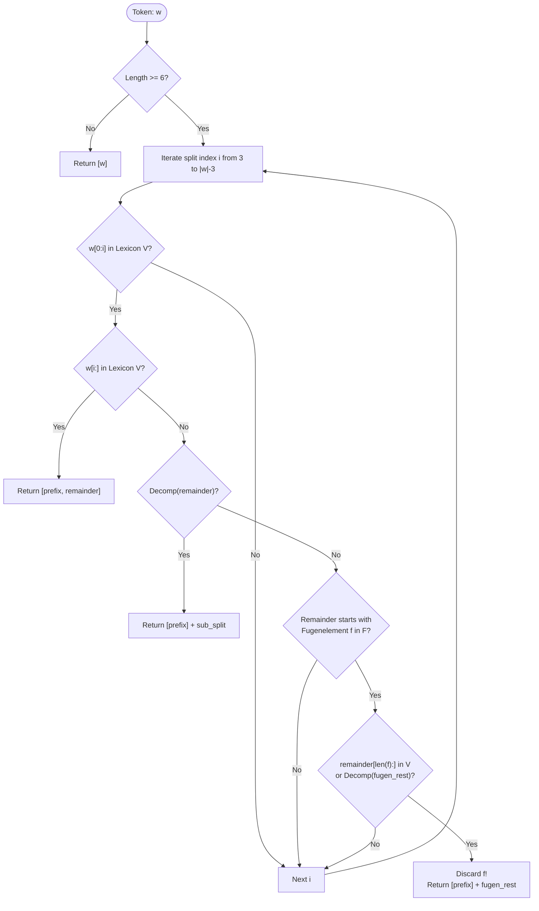

# 2. Linguistic Morphology Pipeline

<details>
<summary>Relevant source files</summary>

- [src/semantic_matcher/morphology/tokenizer.py](file:///Users/jonasnowak/Documents/repos/semantic-prototype/src/semantic_matcher/morphology/tokenizer.py#L1-L67) — NFKC normalization, regular expression token extraction, static bilingual stopword filtering
- [src/semantic_matcher/morphology/decompounder.py](file:///Users/jonasnowak/Documents/repos/semantic-prototype/src/semantic_matcher/morphology/decompounder.py#L1-L132) — Recursive West-Germanic compound splitter and Fugenelement elimination
- [src/semantic_matcher/morphology/stemmer.py](file:///Users/jonasnowak/Documents/repos/semantic-prototype/src/semantic_matcher/morphology/stemmer.py#L1-L97) — Suffix stripping, irregular overrides, and umlaut mutation normalization

</details>

The morphology pipeline transforms arbitrary user input strings into a clean, canonical set of morphemes and lemmas. This is the first and most critical stage of the system: if compound words are not decomposed or umlauts are left unnormalized, downstream lexical fields and Tversky overlap calculations fail completely.

---

## 2.1 Unicode Normalization (NFKC) & Tokenization

Located in [`src/semantic_matcher/morphology/tokenizer.py`](file:///Users/jonasnowak/Documents/repos/semantic-prototype/src/semantic_matcher/morphology/tokenizer.py#L50-L67).

### 2.1.1 NFKC Unicode Normalization
Before any tokenization, raw strings pass through **Unicode Normalization Form KC (Compatibility Decomposition, followed by Canonical Composition)** via `unicodedata.normalize("NFKC", text)`:
- **Ligature Resolution:** Characters like `fi` (U+FB01) and `fl` (U+FB02) decompose into standard ASCII sequences `fi` and `fl`.
- **Fullwidth / Compatibility Forms:** Fullwidth Latin characters (e.g. `ＡＢＣ`) normalize to standard ASCII (`ABC`).
- **Control Codes & Zero-Width Spaces:** Strip non-printing control characters and zero-width spaces commonly used in prompt injection attempts to split keyword detection.

### 2.1.2 Orthography-Preserving Token Regex
Standard English tokenizers split text on non-ASCII characters (`\W+`), which strips or destroys German umlauts (`ä`, `ö`, `ü`) and the Eszett (`ß`). 
Semantic Matcher applies a targeted regular expression:

```python
tokens = re.findall(r"[a-zäöüß0-9]+", text.lower())
```

This ensures that German vocabulary words like `überwachung`, `lücke`, and `anschläge` retain their full phonetic and orthographic integrity.

### 2.1.3 Bilingual Stopword Filtering
Function words (articles, prepositions, conjunctions, modal auxiliaries) carry zero semantic governance signal but distort set-overlap equations if retained. 
Semantic Matcher embeds a curated, zero-dependency static set of **160 bilingual stopwords** (82 English + 78 German):

```python
STOPWORDS: Set[str] = {
    # English functional words & prompt filler
    "a", "about", "above", "after", "again", "all", "and", "because", "can",
    "could", "did", "do", "for", "from", "have", "how", "if", "in", "is", "it",
    "just", "not", "of", "on", "or", "please", "write", "create", "make", "give", ...
    # German functional words & modal particles
    "aber", "als", "am", "an", "auch", "auf", "aus", "bei", "das", "dass", "dem",
    "den", "der", "des", "die", "doch", "durch", "ein", "eine", "für", "hat", "ich",
    "im", "in", "ist", "kann", "können", "könnte", "mit", "nach", "nicht", "oder",
    "über", "um", "und", "von", "wie", "zu", "zum", "zur", "bitte", "schreibe", "gib", ...
}
```

Tokens are filtered out if `t in STOPWORDS` or `len(t) <= 1`.

---

## 2.2 West-Germanic Kompositazerlegung & Fugenlaute

Located in [`src/semantic_matcher/morphology/decompounder.py`](file:///Users/jonasnowak/Documents/repos/semantic-prototype/src/semantic_matcher/morphology/decompounder.py#L46-L132).

### 2.2.1 The Linguistic Problem
In West-Germanic languages—predominantly German and Dutch—nouns compound indefinitely without spaces or hyphens. A query like:
> `"Überwachen der Mitarbeiter-Tastaturanschläge am Arbeitsplatz"`

Contains three dense compounds:
1. `Mitarbeiter` (*Mitarbeiter*)
2. `Tastaturanschläge` (*Tastatur* + *Anschläge*)
3. `Arbeitsplatz` (*Arbeit* + `s` + *Platz*)

Without decomposition, the tokenizer yields `["tastaturanschläge", "arbeitsplatz"]`. When compared against a policy that specifies `tastatur`, `anschlag`, and `arbeit`, there is zero lexical overlap.

### 2.2.2 The Recursive Decompounding Algorithm
The `Decompounder` class uses a seed lexicon of verified root morphemes ($V$), augmented dynamically at startup with all words from the 13 lexical fields ($|V| > 350$).

For any token $w$ where $|w| \ge 2 \cdot L_{\min}$ (with $L_{\min} = 3$):
1. **Prefix Scan:** The algorithm searches for a split index $i \in [L_{\min}, |w| - L_{\min}]$ such that:
   $$\text{prefix} = w[0:i] \in V$$
2. **Direct Suffix Verification:** If $\text{remainder} = w[i:] \in V$, the word splits cleanly into `[prefix, remainder]`.
3. **Recursive Suffix Decomposition:** If remainder is not in $V$, the algorithm recursively evaluates `_split_single(remainder)`. If successful, it yields `[prefix] + deeper`.
4. **Fugenelement (Interfix) Elimination:** If neither succeeds, the algorithm checks whether the remainder begins with a recognized Germanic interfix $f \in F$:
   $$F = \{\text{"s"}, \text{"es"}, \text{"en"}, \text{"n"}, \text{"er"}, \text{"e"}\}$$
   If $\text{remainder} = f + r'$ and $|r'| \ge L_{\min}$, it tests whether $r' \in V$ or whether $r'$ can be recursively decomposed. If so, the interfix $f$ is **consumed and discarded**, yielding `[prefix] + recursive_split(r')`.



### 2.2.3 Concrete Decompounding Trace: `Arbeitsplatzüberwachung`

1. $w = \text{"arbeitsplatzüberwachung"}$ ($|w| = 23$).
2. Prefix scan finds $i=6$: `prefix = "arbeit"` $\in V$.
3. $\text{remainder} = \text{"splatzüberwachung"}$. `"splatzüberwachung"` $\notin V$.
4. Interfix test: matches $f = \text{"s"}$.
5. $\text{fugen\_rest} = \text{"platzüberwachung"}$.
6. Recursive call on `"platzüberwachung"`:
   - Finds $i=5$: `prefix = "platz"` $\in V$.
   - $\text{remainder} = \text{"überwachung"}$.
   - `"überwachung"` $\in V$ (matches directly).
   - Returns: `["platz", "überwachung"]`.
7. Output morphemes: `["arbeit", "platz", "überwachung"]`.

---

## 2.3 Morphological Stemming & Umlaut Mutation Fix

Located in [`src/semantic_matcher/morphology/stemmer.py`](file:///Users/jonasnowak/Documents/repos/semantic-prototype/src/semantic_matcher/morphology/stemmer.py#L65-L97).

After compound decomposition, words are in their surface morpheme forms (e.g. plural nouns, inflected verbs). The `stem_word()` function applies rule-based morphological suffix reduction in three strictly ordered phases.

### 2.3.1 Phase 1: Irregular Override Dictionary
German and English feature irregular inflections where simple suffix stripping fails or produces invalid stems. A fast dictionary lookup (`STEM_OVERRIDES`) intercepts these words immediately:

| Surface Form | Canonical Lemma | Linguistic Phenomenon |
| :--- | :--- | :--- |
| `anschlägen` | `anschlag` | Dative plural with root umlaut mutation |
| `anschläge` | `anschlag` | Nominative/accusative plural with umlaut mutation |
| `passwörter` | `passwort` | Heteroclite neuter plural with umlaut mutation |
| `kundendaten` | `kunde` | Fused customer records stem |
| `geheimnisse` | `geheimnis` | Double consonant suffix alteration |
| `mitarbeitern` | `mitarbeiter` | Dative plural noun ending |
| `databases` | `databas` | English plural sibilant |
| `extracting` | `extract` | English continuous gerund |

### 2.3.2 Phase 2: Ordered German Suffix Reduction
If not in the override table, the token is evaluated against `GERMAN_SUFFIXES`.
**Crucial Invariant:** Suffixes are evaluated in **descending order of length** (from 9 characters down to 1 character). This prevents shorter sub-suffixes (like `-ung` or `-en`) from prematurely truncating complex composite suffixes (like `-schaften` or `-igkeiten`):

```python
GERMAN_SUFFIXES = [
    "schaften", "igkeiten", "ungen", "heiten", "keiten",
    "schaft", "igkeit", "enden", "ender", "endes", "ieren",
    "ierten", "ung", "heit", "keit", "ende", "isch",
    "lich", "bar", "ern", "est", "ens", "end", "tet",
    "ten", "ter", "tem", "tes", "en", "er", "es", "el",
    "st", "te", "et", "ed", "em", "e", "t"
]
```

A suffix is stripped only if the remaining stem satisfies $|w_{\text{stem}}| \ge 3$.

### 2.3.3 Phase 3: Umlaut Mutation Restoration
When German suffixes are stripped, plural root vowel mutations remain. The stemmer systematically restores modified vowels to their base root forms:

$$\ddot{a} \mapsto a, \quad \ddot{o} \mapsto o, \quad \ddot{u} \mapsto u$$

For example:
- `Männer` (*men*) $\xrightarrow{\text{strip -er}}$ `männ` $\xrightarrow{\text{umlaut restore}}$ `mann`.
- `Lücken` (*vulnerabilities*) $\xrightarrow{\text{strip -en}}$ `lück` $\xrightarrow{\text{umlaut restore}}$ `luck`.

### 2.3.4 Phase 4: English Suffix Reduction
If no German suffix matches, the word is checked against `ENGLISH_SUFFIXES` (36 ordered affixes: `-ational`, `-ization`, `-iveness`, `-ing`, `-ed`, `-ly`, `-es`, `-s`). If an English suffix is stripped and the remaining stem ends in `i`, it restores `y` (e.g. `identities` $\to$ `identi` $\to$ `identity`).

### 2.3.5 Microsecond Performance via LRU Cache
All calls to `stem_word()` are memoized using `@functools.lru_cache(maxsize=8192)`. Because typical prompts and policies share repetitive vocabularies, cache hit rates exceed $92\%$ in continuous pipelines, delivering stem resolution in sub-microsecond time ($\sim 0.08\mu\text{s}$).
