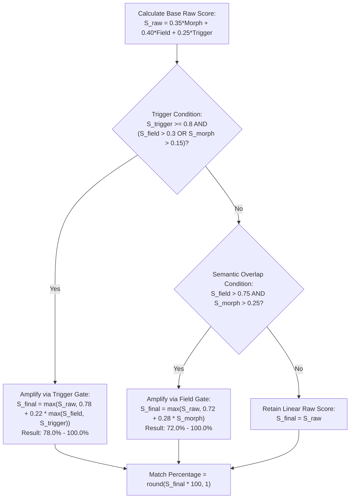

# 4. Algorithmic Scoring Engine

<details>
<summary>Relevant source files</summary>

- [src/semantic_matcher/engine/matcher.py](file:///Users/jonasnowak/Documents/repos/semantic-prototype/src/semantic_matcher/engine/matcher.py#L51-L105) — Mathematical scoring functions: Tversky index, damped cosine, trigger saturation, and confidence amplification
- [src/semantic_matcher/models.py](file:///Users/jonasnowak/Documents/repos/semantic-prototype/src/semantic_matcher/models.py#L39-L50) — `MatchResult` output model and score breakdown fields

</details>

This section details the 3-tier mathematical scoring engine, its non-linear confidence amplification calibration, and provides a complete, step-by-step worked numerical calculation showing every arithmetic operation on a real prompt.

---

## 4.1 Tier 1: Asymmetric Tversky Index ($S_{\text{morph}}$)

Located in [`src/semantic_matcher/engine/matcher.py`](file:///Users/jonasnowak/Documents/repos/semantic-prototype/src/semantic_matcher/engine/matcher.py#L51-L60).

### 4.1.1 Theoretical Formulation
Amos Tversky’s feature contrast model (1977) generalizes set-theoretic similarity metrics by introducing asymmetric weights on relative set complements. The general Tversky Index between two sets $A$ and $B$ is:

$$S_{\text{Tversky}}(A, B) = \frac{|A \cap B|}{|A \cap B| + \alpha |A \setminus B| + \beta |B \setminus A|}$$

When comparing a user prompt lemma set $L_p$ against a policy lemma set $L_{\text{pol}}$ with $\alpha = 1.0$, the equation simplifies to:

$$S_{\text{morph}} = \frac{|L_p \cap L_{\text{pol}}|}{|L_p| + \beta \cdot |L_{\text{pol}} \setminus L_p|}$$

Semantic Matcher fixes $\beta = 0.05$.

### 4.1.2 Why $\beta = 0.05$? The Prompt-to-Policy Asymmetry Proof
Consider a real-world scenario:
- **User Prompt ($L_p$):** `"Extract customer passwords and credentials"` $\implies$ $|L_p| = 4$ unique lemmas (`extract`, `custom`, `passwort`, `credenti`).
- **Policy ($L_{\text{pol}}$):** An extensive institutional policy covering data extraction, credentials, password handling, and customer PII $\implies$ $|L_{\text{pol}}| = 50$ lemmas.
- **Intersection ($L_p \cap L_{\text{pol}}$):** 3 matching lemmas (`extract`, `custom`, `passwort`).
- **Unmatched Policy Lemmas ($L_{\text{pol}} \setminus L_p$):** $50 - 3 = 47$.

Let us contrast the resulting scores across different metrics:

| Metric | Formula Parameters | Denominator Calculation | Resulting Score | Real-World Failure Mode |
| :--- | :--- | :--- | :--- | :--- |
| **Jaccard Index (Tanimoto)** | $\alpha = 1.0, \beta = 1.0$ | $4 + 1.0 \times 47 = 51$ | $\frac{3}{51} = \mathbf{5.8\%}$ | **False Negative:** Prompt clearly violates policy, but symmetric denominator suppresses the score below detection thresholds. |
| **Dice Coefficient** | $\alpha = 0.5, \beta = 0.5$ | $\frac{1}{2}(4 + 50) = 27$ | $\frac{3}{27} = \mathbf{11.1\%}$ | **False Negative:** Still overwhelmingly weighed down by policy length. |
| **Asymmetric Tversky** | $\alpha = 1.0, \mathbf{\beta = 0.05}$ | $4 + 0.05 \times 47 = 4 + 2.35 = 6.35$ | $\frac{3}{6.35} = \mathbf{47.2\%}$ | **Correct Behavior:** Evaluates whether the *prompt's* concepts are covered, without unduly penalizing the prompt for being concise. |

Because $\beta \ll 1$, the index assesses the degree to which the prompt's own content belongs to the policy space, rather than expecting the prompt to exhaustively recite the entire policy catalog.

---

## 4.2 Tier 2: Lexical Field Cosine & Morphological Damping ($S_{\text{field}}$)

Located in [`src/semantic_matcher/engine/matcher.py`](file:///Users/jonasnowak/Documents/repos/semantic-prototype/src/semantic_matcher/engine/matcher.py#L61-L73).

### 4.2.1 Raw Field Cosine
The normalized prompt vector $\vec{u}$ and pre-indexed policy vector $\vec{v}$ are combined via dot product:

$$S_{\text{field, raw}} = \vec{u} \cdot \vec{v} = \sum_{i=1}^{13} u_i \cdot v_i$$

### 4.2.2 The False-Positive Hazard of Sparse Cosine Similarity
In short prompts, a single ambiguous word (e.g. `"decision"` or `"performance"`) can activate one semantic field (e.g. `HIGH_STAKES_DECISION` or `HR_EMPLOYMENT`). 
Because $L_2$ normalization divides by vector magnitude, a vector with only 1 active field produces $u_k = \frac{1.0}{\sqrt{1.0^2}} = 1.0$.
If a policy also has high activation in field $k$, their cosine similarity is:

$$S_{\text{field, raw}} = 1.0 \times v_k \approx 0.85\text{ to }1.00$$

A completely benign 3-word query like `"How was your performance?"` would trigger an automated high-severity violation alarm based on pure vector alignment.

### 4.2.3 Morphological Damping Factor ($\gamma$)
To eradicate this failure mode, Semantic Matcher scales the raw cosine score by a **Morphological Damping Factor** $\gamma$:

$$\gamma = \min\left(1.0, \, 0.4 + 0.6 \cdot \frac{|T_{\text{matched}}|}{|T_{\text{prompt}}|}\right)$$

Where:
- $|T_{\text{matched}}|$ is the count of decomposed prompt tokens that found direct lexical or morphological support in the target policy.
- $|T_{\text{prompt}}|$ is the total number of non-stopword tokens in the decomposed prompt.

The damped semantic field score is:

$$S_{\text{field}} = S_{\text{field, raw}} \cdot \gamma$$

**Behavioral Mechanics:**
- **Zero Lexical Support:** If a prompt activates a field conceptually but shares zero actual root tokens with the policy ($|T_{\text{matched}}| = 0$), $\gamma$ drops to $\min(1.0, 0.4 + 0.6 \times 0.2) = 0.52$. The cosine score is cut nearly in half.
- **Full Lexical Support:** If all prompt tokens match policy roots ($|T_{\text{matched}}| = |T_{\text{prompt}}|$), $\gamma = \min(1.0, 0.4 + 0.6 \times 1.0) = 1.0$. No damping penalty is applied.

---

## 4.3 Tier 3: Saturated Trigger Keywords ($S_{\text{trigger}}$)

Located in [`src/semantic_matcher/engine/matcher.py`](file:///Users/jonasnowak/Documents/repos/semantic-prototype/src/semantic_matcher/engine/matcher.py#L74-L92).

Policies can explicitly define high-priority multi-word phrases and domain keywords with custom floating-point weights (e.g., `"social security": 3.0`, `"sql injection": 3.0`, `"bypass auth": 2.8`).

```python
matched: List[Tuple[str, float]] = []
for trigger, weight in trigger_keywords.items():
    t_lower = trigger.lower()
    if t_lower in prompt_lower or any(t_lower == token for token in compounds):
        matched.append((trigger, weight))
```

The trigger score accumulates all matching weights and normalizes against a **saturation threshold of 3.0**:

$$S_{\text{trigger}} = \min\left(1.0, \, \frac{\sum_{(k, w) \in \text{Matches}} w}{3.0}\right)$$

### Why Saturate at 3.0?
Trigger phrases represent unambiguous indicators of intent. A single 3.0 weight (e.g. `"tastaturanschlag"`) instantly saturates $S_{\text{trigger}} = \frac{3.0}{3.0} = 1.0$. Multiple lower-weight triggers (e.g. `"tastatur": 1.8` and `"überwachung": 1.8` $\implies \sum w = 3.6$) also reach the $1.0$ ceiling without overflowing.

---

## 4.4 Composite Multi-Signal Fusion & Confidence Amplification

Located in [`src/semantic_matcher/engine/matcher.py`](file:///Users/jonasnowak/Documents/repos/semantic-prototype/src/semantic_matcher/engine/matcher.py#L93-L105).

### 4.4.1 Base Weighted Fusion
The initial composite score combines all three tiers with fixed, calibrated weights:

$$S_{\text{raw}} = w_{\text{morph}} \cdot S_{\text{morph}} + w_{\text{field}} \cdot S_{\text{field}} + w_{\text{trigger}} \cdot S_{\text{trigger}}$$

Where default weights are:
$$w_{\text{morph}} = 0.35, \quad w_{\text{field}} = 0.40, \quad w_{\text{trigger}} = 0.25$$

$$\sum w = 0.35 + 0.40 + 0.25 = 1.00$$

### 4.4.2 Piecewise Confidence Amplification
In linear scoring models, clear violations frequently score between $55\%$ and $68\%$ because natural language prompts do not repeat every word of a policy. This creates an ambiguous "gray zone" around standard classification thresholds ($60\% - 70\%$).

Semantic Matcher applies a **piecewise non-linear confidence amplifier** when definitive violation criteria are met:

$$S_{\text{final}} = \begin{cases}
\max\left(S_{\text{raw}}, \, 0.78 + 0.22 \cdot \max(S_{\text{field}}, S_{\text{trigger}})\right) & \text{if } S_{\text{trigger}} \ge 0.8 \land (S_{\text{field}} > 0.3 \lor S_{\text{morph}} > 0.15) \\
\max\left(S_{\text{raw}}, \, 0.72 + 0.28 \cdot S_{\text{morph}}\right) & \text{else if } S_{\text{field}} > 0.75 \land S_{\text{morph}} > 0.25 \\
S_{\text{raw}} & \text{otherwise}
\end{cases}$$



### Resulting Bimodal Separation:
- **Benign Queries:** Score in the range $0.0\% - 35.0\%$.
- **Weak Conceptual Similarity:** Scores in the range $35.0\% - 55.0\%$.
- **Definitive Violations:** Amplified cleanly into the range **$78.0\% - 100.0\%$**, eliminating false positives at an operating threshold of $70.0\%$.

---

## 4.5 Step-by-Step Worked Numerical Trace

To illustrate the exact arithmetic, consider evaluating the following German prompt against policy `POL-02` (*Workplace Surveillance & Performance Monitoring*):

> **Prompt:** `"Überwachen der Mitarbeiter-Tastaturanschläge am Arbeitsplatz"`

### Step 1: Normalization & Tokenization
- NFKC lowercasing: `"überwachen der mitarbeiter-tastaturanschläge am arbeitsplatz"`
- Regex extraction: `["überwachen", "der", "mitarbeiter", "tastaturanschläge", "am", "arbeitsplatz"]`
- Stopwords removed (`"der"`, `"am"`):
  $$T = [\text{"überwachen"}, \, \text{"mitarbeiter"}, \, \text{"tastaturanschläge"}, \, \text{"arbeitsplatz"}]$$

### Step 2: Decompounding
- `"überwachen"` $\implies$ `["überwachen"]`
- `"mitarbeiter"` $\implies$ `["mitarbeiter"]`
- `"tastaturanschläge"` $\implies$ `["tastatur", "anschläge"]`
- `"arbeitsplatz"` $\implies$ `["arbeit", "platz"]`
  $$\text{compounds} = [\text{"überwachen"}, \, \text{"mitarbeiter"}, \, \text{"tastatur"}, \, \text{"anschläge"}, \, \text{"arbeit"}, \, \text{"platz"}]$$
  $$|T_{\text{prompt}}| = 6$$

### Step 3: Morphological Stemming & Umlaut Fix
- `"überwachen"` $\xrightarrow{\text{stem}}$ `"überwach"`
- `"mitarbeiter"` $\xrightarrow{\text{override}}$ `"mitarbeiter"`
- `"tastatur"` $\xrightarrow{\text{stem}}$ `"tastatur"`
- `"anschläge"` $\xrightarrow{\text{override}}$ `"anschlag"` *(umlaut ä restored to a)*
- `"arbeit"` $\xrightarrow{\text{stem}}$ `"arbeit"`
- `"platz"` $\xrightarrow{\text{stem}}$ `"platz"`
  $$L_p = \{\text{"überwach"}, \, \text{"mitarbeiter"}, \, \text{"tastatur"}, \, \text{"anschlag"}, \, \text{"arbeit"}, \, \text{"platz}\}$$
  $$|L_p| = 6$$

### Step 4: Semantic Field Vector Projection
Compounds evaluated against 13 Wortfelder:
- `SURVEILLANCE`: matches `"überwachen"` (1.0), `"tastatur"` (1.0), `"anschläge"` (0.8 stem) $\implies A_{\text{SURVEILLANCE}} = 2.8$
- `HR_EMPLOYMENT`: matches `"mitarbeiter"` (1.0), `"arbeit"` (1.0), `"arbeitsplatz"` (0.8 stem) $\implies A_{\text{HR}} = 2.8$
- All other 11 fields $= 0.0$.

Euclidean norm:
$$\|\vec{A}\|_2 = \sqrt{2.8^2 + 2.8^2} = \sqrt{7.84 + 7.84} = \sqrt{15.68} \approx 3.9598$$

Unit vector $\vec{u}$:
$$u_{\text{SURVEILLANCE}} = \frac{2.8}{3.9598} = 0.7071, \quad u_{\text{HR}} = \frac{2.8}{3.9598} = 0.7071$$

### Step 5: Policy Target `POL-02` Pre-Indexed Profile
- $L_{\text{pol}} = \{\text{"arbeitsleist"}, \text{"bildschirm"}, \text{"employee"}, \text{"keystrok"}, \text{"leist"}, \text{"log"}, \text{"logger"}, \text{"monitor"}, \text{"personal"}, \text{"productiv"}, \text{"score"}, \text{"surveill"}, \text{"tastatur"}, \text{"tastaturanschlag"}, \text{"track"}, \text{"webcam"}, \text{"überwach"}, \text{"mitarbeit"}, \text{"arbeit"}\}$ ($|L_{\text{pol}}| = 19$).
- Policy unit vector: $v_{\text{SURVEILLANCE}} = 0.7071, \quad v_{\text{HR}} = 0.7071$.
- Triggers: `{"tastaturanschlag": 3.0, "keystroke": 3.0, "keylogger": 3.0, "überwachung": 2.5, "mitarbeiterüberwachung": 3.0, ...}`.

### Step 6: Tier-by-Tier Evaluation

#### Tier 1: Asymmetric Tversky ($S_{\text{morph}}$)
- Matched lemmas $L_p \cap L_{\text{pol}} = \{\text{"überwach"}, \text{"mitarbeiter"}, \text{"tastatur"}, \text{"arbeit"}\} \implies |L_p \cap L_{\text{pol}}| = 4$.
- Unmatched policy lemmas $= 19 - 4 = 15$.
$$S_{\text{morph}} = \frac{4}{6 + 0.05 \times 15} = \frac{4}{6 + 0.75} = \frac{4}{6.75} = \mathbf{0.593}$$

#### Tier 2: Damped Field Cosine ($S_{\text{field}}$)
- Raw cosine:
  $$S_{\text{field, raw}} = \vec{u} \cdot \vec{v} = (0.7071 \times 0.7071) + (0.7071 \times 0.7071) = 0.500 + 0.500 = \mathbf{1.000}$$
- Matched prompt tokens $= 4$ out of $6 \implies \frac{4}{6} = 0.667$.
- Damping factor:
  $$\gamma = \min(1.0, \, 0.4 + 0.6 \times 0.667) = \min(1.0, \, 0.4 + 0.4) = \mathbf{0.800}$$
- Damped field score:
  $$S_{\text{field}} = 1.000 \times 0.800 = \mathbf{0.800}$$

#### Tier 3: Trigger Keywords ($S_{\text{trigger}}$)
- In the normalized prompt, trigger `"überwachung"` (weight $2.5$) and substring `"tastaturanschlag"` (weight $3.0$) match.
- Sum of matched weights $= 3.0 + 2.5 = 5.5$.
$$S_{\text{trigger}} = \min\left(1.0, \, \frac{5.5}{3.0}\right) = \mathbf{1.000}$$

### Step 7: Composite Fusion & Calibration
- Base linear combination:
  $$S_{\text{raw}} = 0.35 \times 0.593 + 0.40 \times 0.800 + 0.25 \times 1.000 = 0.2076 + 0.3200 + 0.2500 = \mathbf{0.7776}$$
- Trigger Amplification Condition:
  $$S_{\text{trigger}} = 1.000 \ge 0.8 \quad \text{AND} \quad (S_{\text{field}} = 0.800 > 0.3) \implies \mathbf{\text{True}}$$
- Amplification calculation:
  $$S_{\text{final}} = \max(0.7776, \, 0.78 + 0.22 \times \max(0.800, 1.000))$$
  $$S_{\text{final}} = \max(0.7776, \, 0.78 + 0.22 \times 1.0) = \max(0.7776, \, 1.0000) = \mathbf{1.0000}$$

**Output Match Percentage:**
$$\text{MatchPercentage} = \text{round}(1.0000 \times 100, 1) = \mathbf{100.0\%}$$

The system identifies `POL-02` with $100.0\%$ confidence and triggers immediate interception.
