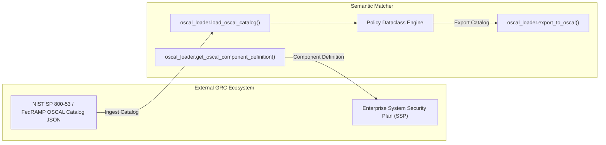

# 5. Policy Ingestion, Storage & Pre-Decomposition Indexing

<details>
<summary>Relevant source files</summary>

- [src/semantic_matcher/storage/indexer.py](file:///Users/jonasnowak/Documents/repos/semantic-prototype/src/semantic_matcher/storage/indexer.py#L1-L155) — Pre-decomposition compilation engine and timestamp-based cache invalidation
- [src/semantic_matcher/storage/markdown_loader.py](file:///Users/jonasnowak/Documents/repos/semantic-prototype/src/semantic_matcher/storage/markdown_loader.py#L1-L402) — Zero-dependency YAML frontmatter, table, and markdown policy parser
- [src/semantic_matcher/storage/oscal_loader.py](file:///Users/jonasnowak/Documents/repos/semantic-prototype/src/semantic_matcher/storage/oscal_loader.py#L1-L353) — NIST OSCAL 1.1.0 Catalog ingestion, export, and Component Definition generation

</details>

This section covers how policies are ingested from varied source formats (JSON, directories, Markdown, and NIST OSCAL 1.1.0), compiled offline into normalized representations, and cached to disk for zero-latency runtime access.

---

## 5.1 Pre-Decomposition Indexing & Cache Invalidation

Located in [`src/semantic_matcher/storage/indexer.py`](file:///Users/jonasnowak/Documents/repos/semantic-prototype/src/semantic_matcher/storage/indexer.py#L33-L155).

### 5.1.1 The Offline Compilation Principle
Natural language tokenization, compound splitting, stemming, and vector normalization take $\approx 0.1\text{ms} - 0.5\text{ms}$ per document. 
If an application checked 100 policies at runtime by parsing them on the fly, latency would balloon to $30\text{ms} - 50\text{ms}$.

`PolicyIndexer` shifts all policy processing offline:
1. Every policy is processed once into a `PredecomposedPolicy` object:
   - Concatenates name, description, primary fields, and trigger keywords.
   - Executes tokenization, compound splitting, and suffix stemming.
   - Computes and caches the normalized 13-dimensional $L_2$ activation vector.
   - Extracts unique lemma sets for instantaneous set-intersection operations.
2. The entire index is serialized to `policy_index.json`.
3. At runtime, the engine deserializes `policy_index.json` in $\approx 1.5\text{ms}$ on process startup, after which all policy data structures reside in memory.

### 5.1.2 Timestamp-Based Automatic Cache Invalidation (`mtime`)
To ensure administrators never serve stale indices after modifying policy documents, `PolicyIndexer.get_or_load_index()` performs automatic file modification time (`st_mtime`) checks:

```python
cache_mtime = self.index_path.stat().st_mtime
if self.policies_path.is_file() and self.policies_path.stat().st_mtime > cache_mtime:
    return self.build_and_save_index()
elif self.policies_path.is_dir():
    dir_mtime = max(
        (f.stat().st_mtime for f in self.policies_path.glob("**/*") if not f.name.startswith(".")),
        default=0.0,
    )
    if dir_mtime > cache_mtime:
        return self.build_and_save_index()
```

If any source file in a policy directory is newer than the cached index, the engine recompiles the index automatically in the background.

### 5.1.3 Read-Only Container Filesystem Resilience
In hardened production environments (e.g. AWS Lambda, read-only Docker containers, Kubernetes Pods with `readOnlyRootFilesystem: true`), attempting to write a cache file to disk raises an `OSError`. 

`PolicyIndexer` wraps cache serialization in a `try...except OSError` block. When write permissions are denied, it gracefully retains the compiled index in volatile memory without raising an exception or crashing the application container.

---

## 5.2 Native JSON & Directory Ingestion

### 5.2.1 Single Catalog JSON (`policies.json`)
The canonical JSON format represents policies as an array of structured objects:

```json
[
  {
    "policy_id": "SEC-01",
    "name": "Unauthorized Credential Exfiltration",
    "framework": "NIST SP 800-53 SC-7",
    "description": "Prohibits extracting, dumping, or transmitting user credentials, tokens, or hashes.",
    "primary_fields": ["CREDENTIALS", "SECURITY"],
    "trigger_keywords": {
      "dump passwords": 3.0,
      "steal token": 2.8
    }
  }
]
```

*(Note: `primary_fields` and `trigger_keywords` are optional. If omitted, the engine infers them automatically from the text).*

### 5.2.2 Directory of Individual JSON Policy Files
Large enterprise organizations often maintain policies in separate repository files owned by different governance teams (e.g., `policies/gdpr.json`, `policies/hipaa.json`, `policies/security.json`). 

When `policies_path` points to a directory, `PolicyIndexer` scans for all `*.json` files (excluding hidden files and `*.index.json`), aggregates them into a unified policy list, and builds a consolidated cache.

---

## 5.3 Markdown Policy Parser (Frontmatter & Tables)

Located in [`src/semantic_matcher/storage/markdown_loader.py`](file:///Users/jonasnowak/Documents/repos/semantic-prototype/src/semantic_matcher/storage/markdown_loader.py#L61-L240).

To enable security and legal teams to author policies directly in Git repositories using standard Markdown (without learning JSON syntax), Semantic Matcher includes a zero-dependency, pure-Python parser supporting three distinct authoring styles:

### 1. YAML Frontmatter Format
```markdown
---
policy_id: POL-PRIVACY-01
name: Personal Data Protection
framework: GDPR Art. 6
primary_fields:
  - PRIVACY
  - CREDENTIALS
trigger_keywords:
  ssn: 3.0
  passport: 2.5
---

# Policy Statement
Prohibits the unauthorized extraction or disclosure of personally identifiable records.
```

The embedded `parse_simple_yaml()` state machine parses top-level scalars, inline lists (`[A, B]`), bullet lists (`- item`), and nested numerical dictionaries (`word: 3.0`) without requiring third-party dependencies like `PyYAML`.

### 2. GitHub-Flavored Markdown Tables
Policies can be summarized within tabular Markdown files:

```markdown
| Policy ID | Name | Framework | Description |
| :--- | :--- | :--- | :--- |
| SEC-01 | SQL Injection Defense | OWASP LLM01 | Prohibits attempts to manipulate database queries via unescaped input. |
| HR-02 | Keylogger Restriction | Works Council | Restricts surveillance of worker keystrokes and webcam feeds. |
```

`parse_markdown_table()` parses column headers and row cells, automatically mapping columns like `Framework`, `Category`, and `Triggers`.

### 3. Header-Delimited Markdown Sections
In documents lacking structured metadata, the parser detects Markdown headers (e.g. `# POL-01: Name` or `## Data Governance`), extracts the body text as the policy `description`, and extracts inline attributes like `**Framework:** ISO 27001` or `**Fields:** PRIVACY`.

---

## 5.4 NIST OSCAL 1.1.0 Catalog & Component Definition

Located in [`src/semantic_matcher/storage/oscal_loader.py`](file:///Users/jonasnowak/Documents/repos/semantic-prototype/src/semantic_matcher/storage/oscal_loader.py#L84-L353).

The **Open Security Controls Assessment Language (OSCAL)**, developed by the National Institute of Standards and Technology (NIST), is the official federal standard for machine-readable cybersecurity and compliance documents. Semantic Matcher provides native bi-directional compliance across two core OSCAL models:



### 5.4.1 Ingesting NIST SP 800-53 & FedRAMP OSCAL Catalogs
When passing an official OSCAL Catalog (such as NIST SP 800-53 Rev. 5), `load_oscal_catalog()` recursively traverses arbitrary control group hierarchies. The recursive extractor maps OSCAL JSON paths to the `Policy` dataclass:

| Semantic Matcher Field | NIST OSCAL 1.1.0 JSON Path | Semantic Extraction Rule |
| :--- | :--- | :--- |
| `policy_id` | `control.props[name="label"].value` or `control.id` | Normalized control identifier (e.g., `AC-2`, `SI-4`). |
| `name` | `control.title` | Official control name. |
| `framework` | `catalog.metadata.title` or `control.props[name="framework"]` | Catalog title (e.g., `"NIST SP 800-53 Rev. 5"`). |
| `description` | `control.parts[name="statement"|"guidance"].prose` | Normative control requirements and implementation guidance. |
| `primary_fields` | `control.props[name="primary-field"|"category"]` | Mapped to the 13 West-Germanic Wortfelder. |
| `trigger_keywords` | `control.props[name="trigger-keyword"].value + remarks` | High-signal phrases and saturation multipliers. |

### 5.4.2 Exporting Policies to NIST OSCAL 1.1.0 JSON
Any collection of active policies (whether originally loaded from JSON or Markdown) can be exported to standard NIST OSCAL 1.1.0 JSON:

```bash
semantic-matcher --export-oscal my_oscal_catalog.json
```

The exporter generates valid UUIDs (`uuid.uuid4()`), RFC 3339 UTC timestamps, metadata sections, control statements, and OSCAL property annotations.

### 5.4.3 OSCAL Component Definition for System Security Plans (SSPs)
Under FedRAMP and enterprise compliance regimes, security software must supply a **Component Definition** declaring which controls it implements.
Semantic Matcher exports an official NIST OSCAL 1.1.0 Component Definition:

```bash
semantic-matcher --oscal-component
```

The component definition declares implementation statements for:
- **NIST SP 800-53 SI-4 (Information System Monitoring):** Continuous lexical and morphological prompt inspection.
- **NIST SP 800-53 SC-7 (Boundary Protection):** Guardrail boundary defense against exfiltration of credentials and tokens.
- **NIST SP 800-53 AC-3 (Access Enforcement):** Interception of instructions designed to bypass access boundaries.
- **OWASP Top 10 for LLMs (LLM01, LLM02, LLM06):** Mitigation for Prompt Injection, Sensitive Data Disclosure, and Excessive Agency.
