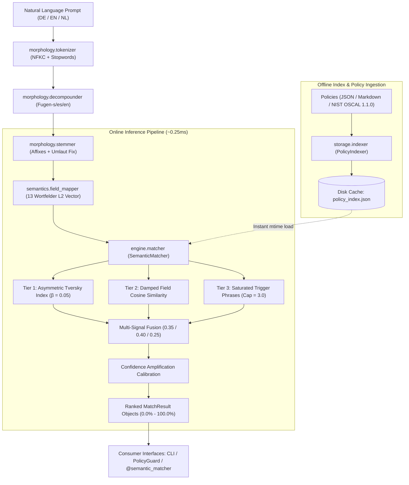

# Semantic Matcher — Technical Documentation Wiki

Welcome to the **Semantic Matcher DeepWiki** documentation. This wiki provides a comprehensive, ground-truth technical explanation of the architecture, linguistic algorithms, mathematical formulations, storage engines, and integration interfaces of the `semantic-matcher` guardrail.

---

## Table of Contents

- [1. Overview & System Architecture](1_overview.md)
  - [1.1 Purpose & Scope](1_overview.md#11-purpose--scope)
  - [1.2 Architectural Philosophy & Invariants](1_overview.md#12-architectural-philosophy--invariants)
  - [1.3 Why Algorithmic Matching for West-Germanic Languages?](1_overview.md#13-why-algorithmic-matching-for-west-germanic-languages)
  - [1.4 System Architecture & Component Diagram](1_overview.md#14-system-architecture--component-diagram)
  - [1.5 End-to-End Execution Lifecycles](1_overview.md#15-end-to-end-execution-lifecycles)
- [2. Linguistic Morphology Pipeline](2_morphology_pipeline.md)
  - [2.1 Unicode Normalization (NFKC) & Tokenization](2_morphology_pipeline.md#21-unicode-normalization-nfkc--tokenization)
  - [2.2 West-Germanic Kompositazerlegung & Fugenlaute](2_morphology_pipeline.md#22-west-germanic-kompositazerlegung--fugenlaute)
  - [2.3 Morphological Stemming & Umlaut Mutation Fix](2_morphology_pipeline.md#23-morphological-stemming--umlaut-mutation-fix)
- [3. Semantic Lexical Field Vector Space](3_semantics_and_wortfeld.md)
  - [3.1 Jost Trier's Wortfeldtheorie & Conceptual Fields](3_semantics_and_wortfeld.md#31-jost-triers-wortfeldtheorie--conceptual-fields)
  - [3.2 3-Tier Multi-Weight Kernel](3_semantics_and_wortfeld.md#32-3-tier-multi-weight-kernel)
  - [3.3 Euclidean L2 Normalization & Fast Cosine Dot Product](3_semantics_and_wortfeld.md#33-euclidean-l2-normalization--fast-cosine-dot-product)
- [4. Algorithmic Scoring Engine](4_scoring_engine.md)
  - [4.1 Tier 1: Asymmetric Tversky Index](4_scoring_engine.md#41-tier-1-asymmetric-tversky-index)
  - [4.2 Tier 2: Lexical Field Cosine & Morphological Damping](4_scoring_engine.md#42-tier-2-lexical-field-cosine--morphological-damping)
  - [4.3 Tier 3: Saturated Trigger Keywords](4_scoring_engine.md#43-tier-3-saturated-trigger-keywords)
  - [4.4 Composite Multi-Signal Fusion & Confidence Amplification](4_scoring_engine.md#44-composite-multi-signal-fusion--confidence-amplification)
  - [4.5 Step-by-Step Worked Numerical Trace](4_scoring_engine.md#45-step-by-step-worked-numerical-trace)
- [5. Policy Ingestion, Storage & Pre-Decomposition Indexing](5_storage_and_indexing.md)
  - [5.1 Pre-Decomposition Indexing & Cache Invalidation](5_storage_and_indexing.md#51-pre-decomposition-indexing--cache-invalidation)
  - [5.2 Native JSON & Directory Ingestion](5_storage_and_indexing.md#52-native-json--directory-ingestion)
  - [5.3 Markdown Policy Parser (Frontmatter & Tables)](5_storage_and_indexing.md#53-markdown-policy-parser-frontmatter--tables)
  - [5.4 NIST OSCAL 1.1.0 Catalog & Component Definition](5_storage_and_indexing.md#54-nist-oscal-110-catalog--component-definition)
- [6. Integration, Extensions & API Reference](6_integration_and_api.md)
  - [6.1 PolicyGuard OOP & Functional APIs](6_integration_and_api.md#61-policyguard-oop--functional-apis)
  - [6.2 Function Decorator (`@semantic_matcher`)](6_integration_and_api.md#62-function-decorator-semantic_matcher)
  - [6.3 Command-Line Interface (CLI) & CI/CD Gating](6_integration_and_api.md#63-command-line-interface-cli--cicd-gating)
  - [6.4 Data Models & Schemas](6_integration_and_api.md#64-data-models--schemas)
- [7. Performance, Invariants & Verification](7_performance_and_verification.md)
  - [7.1 Latency Analysis: Microseconds vs. LLM Inferences](7_performance_and_verification.md#71-latency-analysis-microseconds-vs-llm-inferences)
  - [7.2 Determinism & Zero-LLM Guarantees](7_performance_and_verification.md#72-determinism--zero-llm-guarantees)
  - [7.3 Test Suite Architecture & Verification Matrix](7_performance_and_verification.md#73-test-suite-architecture--verification-matrix)
- [8. Glossary & Conceptual Reference](8_glossary.md)

---

## Quick Architecture Map

---

## Online Interactive Documentation

For a visual interactive sandbox demonstrating the 4-stage pipeline directly in your web browser with real-time prompt decomposition and scoring, visit the [GitHub Pages Site](https://jonasnowak.github.io/semantic-matcher-prototype/).
